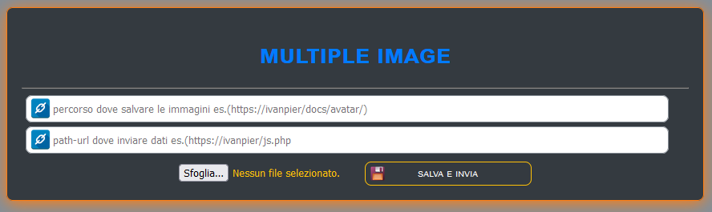

# INIZIO

Carica in una sola volta più immagini

<a href="https://ivanpierdeveloper.github.io/multiple-images/" target="_blank">Vai all'APP ^__^</a>

NOTA:  Se non dovesse funzionare, controllare di aver scritto correttamente l'url, consentire contenuti misti (es. http https (disabilitando il lucchetto nella barra degli indirizzi)) e per ultimo ma non per questo meno importatnte verificare CORS. Quest'ultimo si risolve installando un addons di FireFox <a href="https://addons.mozilla.org/it/firefox/addon/cors-everywhere/">installa(CORS)</a>. buon lavoro.

# FINE
